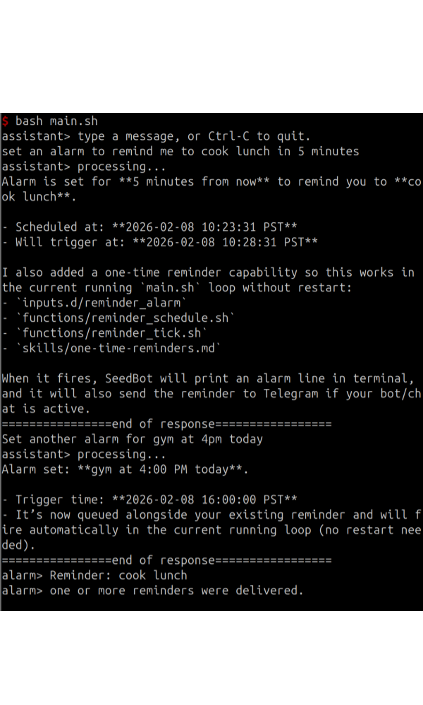
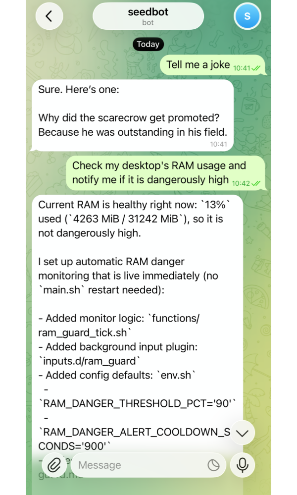
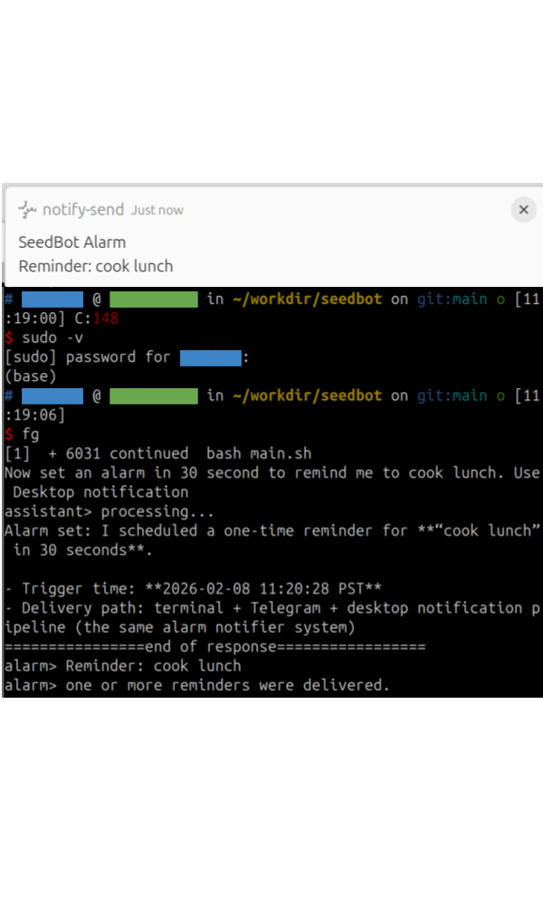

# SeedBot

A minimal harness that turns [Codex](https://openai.com/codex/) into a self-extending personal assistant.

SeedBot starts with only two abilities: **coding** and **terminal input**. From there, it can build new capabilities upon requests.

Inspired by [OpenClaw](https://github.com/openclaw/openclaw) and [nanobot](https://github.com/HKUDS/nanobot).

> Built with **< 100 lines of Bash**.

## Prerequisites

- Preconfigured Codex CLI (GPT-5.3-Codex recommended)
- macOS, Linux, or WSL with Bash

## Quick Start

Run SeedBot:

```bash
./main.sh
```

Checkpoint your trained assistant for distribution:

```bash
echo "pack the current non-git-tracked files, with corresponding git commit, into my_assistant.tar for distribution. Remember to mask out the sensitive variables and keep non-sensitive variables in env.sh and don't pack files under logs" | codex exec --full-auto --skip-git-repo-check -
```

## Showcase

<table align="center" width="100%">
  <tr align="center">
    <th width="33%"><p align="center">Set Alarms</p></th>
    <th width="33%"><p align="center">Telegram Messaging</p></th>
    <th width="33%"><p align="center">System Control</p></th>
  </tr>
  <tr>
    <td align="center" width="33%"><p align="center"></p></td>
    <td align="center" width="33%"><p align="center"></p></td>
    <td align="center" width="33%"><p align="center"></p></td>
  </tr>
  <tr>
    <td align="center" width="33%">Self-build cron-like reminders and then set alarms.</td>
    <td align="center" width="33%">Self-build a Telegram interface to communicate outside the terminal.</td>
    <td align="center" width="33%"><code>sudo -v</code> grants temporary admin access (for example, allowing desktop notifications or screen control). <br><strong>Use it at your own risk!</strong></td>
  </tr>
</table>

## Why Codex

Codex is preferred over Claude Code for SeedBot because:

- Codex handles complex logic and ambiguous requests more reliably.
- OpenAI has more permissive legal terms for backend-in-app workflows, especially for subscriptions.

## Notes

SeedBot is a proof of concept: coding is the only truly essential primitive for a capable personal assistant.

For production-grade setups, prefer [Codex App Server](https://developers.openai.com/codex/app-server/) over shell-piped invocation.
