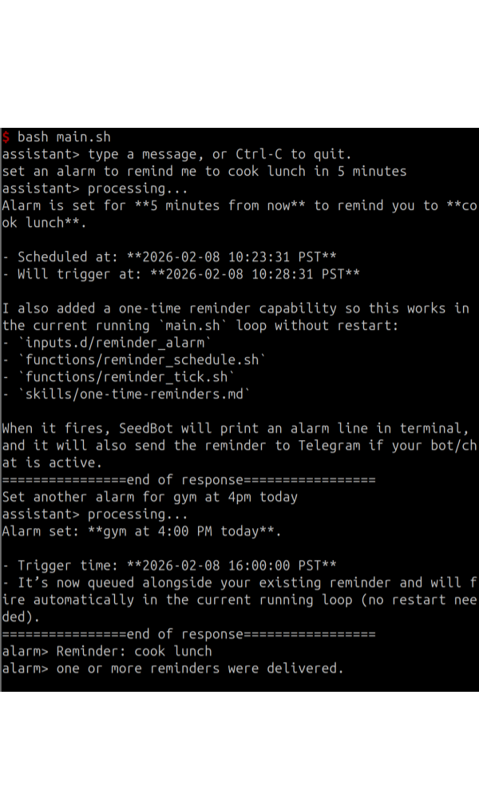
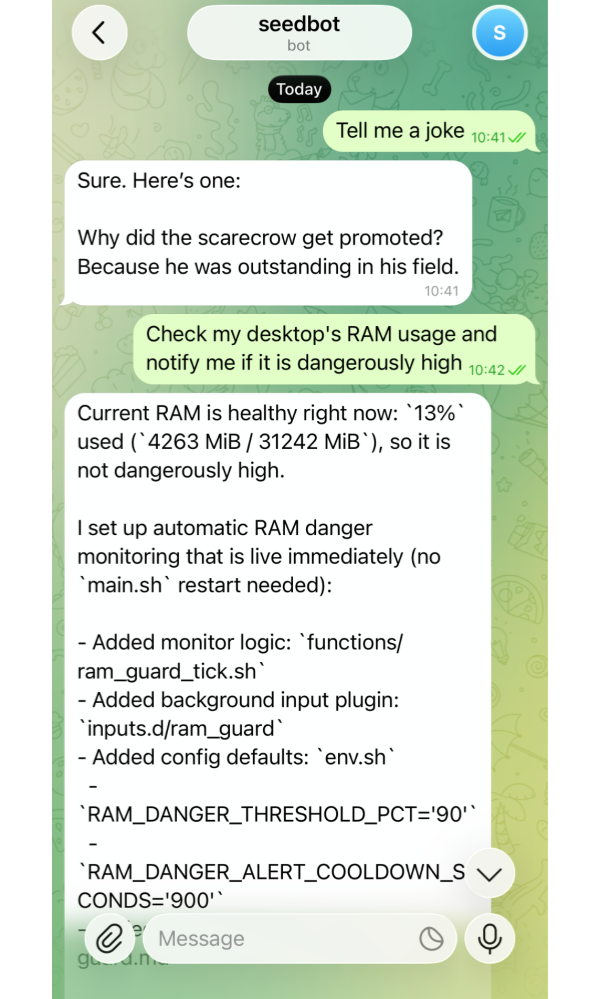
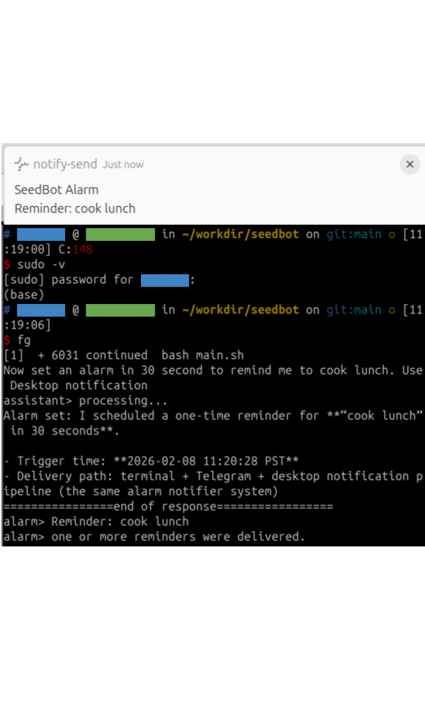

# SeedBot: a self-evolving personal assistant

A bootstrapper that turns [Codex](https://openai.com/codex/) into a personal assistant.

SeedBot starts with only two abilities: **coding** and **terminal input**. From there, it can build new capabilities upon requests.

Inspired by [OpenClaw](https://github.com/openclaw/openclaw) and [nanobot](https://github.com/HKUDS/nanobot).

> Built with **< 100 lines of Bash**.

## Prerequisites

- Preconfigured Codex CLI (GPT-5.5 recommended)
- macOS, Linux, or WSL with Bash

## Quick Start

```bash
# This is pre-requisite for MacOS
brew install coreutils
brew install bash
alias timeout=gtimeout
```

Run SeedBot (add `-v` if you want to view codex execution details):

```bash
./main.sh
```

Pre-configured Slack integration:

1. Download and extract the prepared Slack integration module:

```bash
wget https://github.com/RalphMao/seedbot/releases/download/v0.3/slack_integration.tar
tar xf slack_integration.tar
```

2. Create your own Slack workspace or use any existing workspace that allows app integration.

3. [Create a Slack app](https://api.slack.com/apps) with an OAuth bot token. Grant the following scopes:
   - `channels:history`
   - `channels:read`
   - `chat:write`
   - `reactions:write`

4. In your workspace, create a channel, invite the bot to it, and note the channel ID.

5. Fill in `env.sh` with your bot token and channel ID.

Checkpoint your "trained" assistant:

```bash
echo "pack the current non-git-tracked files, with corresponding git commit, into my_assistant.tar for distribution. Remember not to pack files under workspace/ and  logs/" | codex exec --full-auto --skip-git-repo-check -
```

## Showcase

<table align="center" width="100%">
  <tr align="center">
    <th width="33%"><p align="center">Set Alarms</p></th>
    <th width="33%"><p align="center">Telegram Messaging</p></th>
    <th width="33%"><p align="center">System Control</p></th>
  </tr>
  <tr>
    <td align="center" width="33%"><p align="center"></p></td>
    <td align="center" width="33%"><p align="center"></p></td>
    <td align="center" width="33%"><p align="center"></p></td>
  </tr>
  <tr>
    <td align="center" width="33%">Self-build cron-like reminders and then set alarms.</td>
    <td align="center" width="33%">Self-build a Telegram interface to communicate outside the terminal.</td>
    <td align="center" width="33%"><code>sudo -v</code> grants temporary admin access (for example, allowing desktop notifications or screen control). <br><strong>Use it at your own risk!</strong></td>
  </tr>
</table>

## Why Codex

Codex is preferred over Claude Code for SeedBot because:

- Codex handles complex logic and ambiguous requests more reliably.
- OpenAI has more permissive legal terms for backend-in-app workflows, especially for subscriptions.

## Notes

SeedBot is a proof of concept: coding is the only truly essential primitive for a capable personal assistant.

For production-grade setups, prefer [Codex App Server](https://developers.openai.com/codex/app-server/) over shell-piped invocation.
